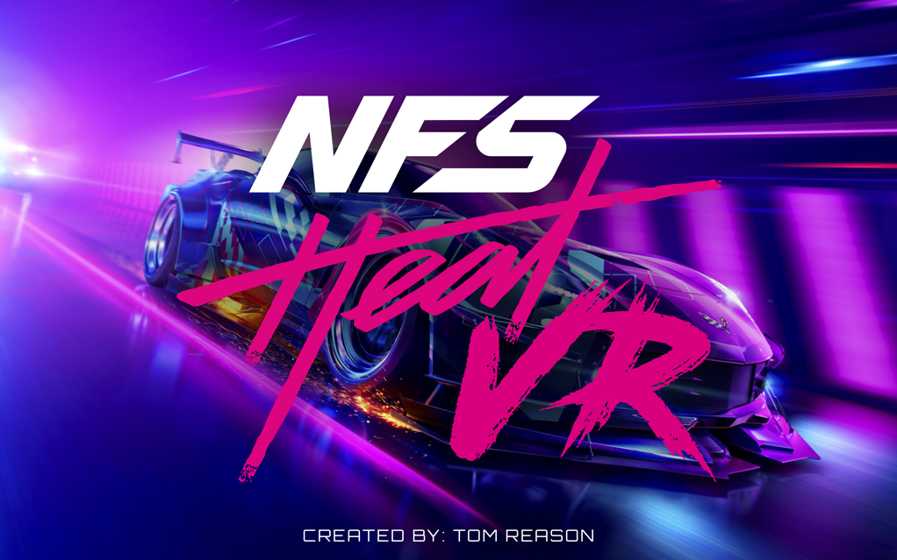

# NFS Heat VR



Experimental OpenXR VR runtime for the PC Steam/EA version of **Need for Speed Heat**.

The project injects a D3D11 runtime into the game at launch, presents Heat's final frame in an OpenXR headset, adds direct seated head tracking for the in-car camera and offers depth-reconstructed stereo. It is a community prototype, not an EA product.

> Tested with `NeedForSpeedHeat.exe` 1.0.60.7040 / Steam build 10351341. Use it in single-player only. It does not include any files from the game.

## Features

- Steam/EA launch hand-off detection and automatic runtime injection.
- D3D11/OpenXR headset presentation with a live settings panel.
- Frostbite camera hook for yaw, pitch and limited seated 6DoF head movement.
- Automatic engine-FOV matching to the active headset OpenXR FOV. This is useful for Pimax Normal/Ultra-Narrow modes.
- Depth-reconstructed stereo from Heat's readable depth buffer. This remains an approximation: occluded pixels cannot be reconstructed from one game frame.
- AMD FidelityFX FSR 1 EASU + RCAS for the headset copy when the captured game image needs upscaling. The `Headset Upscaler` control adjusts RCAS sharpness; `0` disables it.
- Portable release: the launcher locates `NeedForSpeedHeat.exe` beside itself, so no personal Steam-library path is compiled in.

## Install a release

1. Close Need for Speed Heat.
2. Start your OpenXR runtime (Pimax Play, SteamVR, Meta Quest Link, etc.).
3. Extract the contents of the release ZIP **directly into the folder that contains `NeedForSpeedHeat.exe`**.
4. Run `NFSHeatVRControl.exe`, choose the in-game resolution, then click **Launch NFS Heat VR**.

The launcher changes only the user's Heat profile in `Documents\Need for Speed Heat\settings\PROFILEOPTIONS_profile` before launch. It creates a one-time `.NFSHeatVR.backup` copy before its first edit. It sets the selected width and height at native scene scale `100%`; it does not use an extra internal supersampling multiplier.

The four required files are:

```text
NFSHeatVRControl.exe
NFSHeatVRLauncher.exe
NFSHeatVRRuntime.dll
NFSHeatVR.ini
```

## Controls

| Key | Action |
| --- | --- |
| `F8` | Enable/disable direct Frostbite head tracking |
| `F9` | Recenter head tracking |
| `Home` | Open the settings panel while in game |
| `Ctrl+F3` | Enable/disable depth stereo |

`Insert` is deliberately unused: on the tested Pimax runtime that scan code could crash `PiServiceLauncher` during an active OpenXR session.

## Settings notes

- Keep **Headset fullscreen**, **Real engine FOV** and **Match engine FOV to HMD** enabled for the normal headset mode.
- Select Pimax Normal/Ultra-Narrow before starting the game. A running session can update its camera FOV, but OpenXR texture dimensions are chosen when the VR session is created.
- Start depth stereo around `200–300`. `400–600` are available, but stronger screen-space parallax will always be less reliable at foreground object edges.
- Changing game resolution applies on the next game launch. Other controls save live.

## Build from source

Requirements: Windows, Visual Studio 2022 with Desktop C++, CMake, Ninja (provided by Visual Studio) and Git.

```powershell
Set-ExecutionPolicy -Scope Process Bypass
.\build.ps1
```

The script retrieves only two pinned source dependencies: MinHook v1.3.4 and OpenXR-SDK release-1.1.60. It builds an x64 Release with the Microsoft C++ runtime statically linked. Output files appear in `bin`.

## Limitations

- D3D11 only. If Heat chooses a different renderer, the runtime exits without touching the game.
- Depth stereo is not native dual-camera rendering. It is a best-effort reconstruction from the completed colour frame and depth texture.
- The Frostbite camera addresses are version-specific and must be re-profiled for other executable builds.
- This project does not bypass anti-cheat, network checks or EA services.

## Credits and licenses

Created by TOM REASON.

The code in this repository is released under the [MIT License](LICENSE). It includes or links against third-party components listed in [THIRD_PARTY_NOTICES.md](THIRD_PARTY_NOTICES.md), including AMD FidelityFX FSR 1 (MIT), MinHook (BSD-2-Clause) and OpenXR-SDK (Apache-2.0).

Need for Speed Heat and Frostbite are trademarks and property of Electronic Arts. This project is not affiliated with or endorsed by Electronic Arts.
